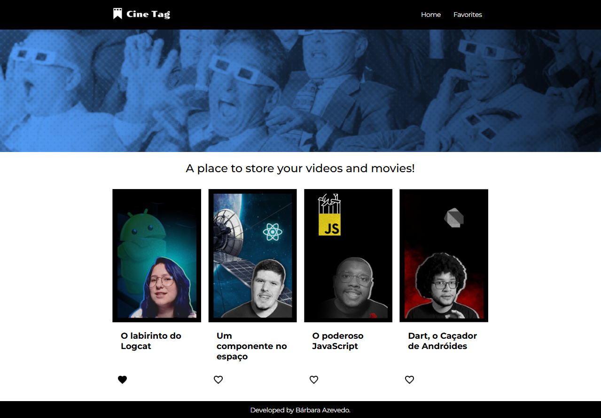

# 🎬 Cine Tag

A web application built with **React**, allowing users to explore a video gallery, watch each video on a dedicated player page, and manage a list of favorite videos using global state.

## 📽️ Features

- Browse videos organized by categories
- Consume an **external API** using `Fetch API`
- Use of **dynamic routes** to display selected video on a unique player page
- Global favorites system using **React Context API**
- "My Favorites" page to quickly access saved videos
- Clickable thumbnails that redirect to the corresponding video player
- Deployed and hosted on **Vercel**
- Mock API prototype hosted on **My JSON Server**

## ⚙️ Technologies Used

- **React**: JavaScript library for building component-based user interfaces
- **JavaScript (ES6+)**
- **Styled-components**
- **React Router**: For managing routes and navigation
- **My JSON Server**: API mock for prototyping
- **Fetch API**: For making HTTP requests

## 🛠 Prerequisites

- Node.js (v16 or higher)
- npm or yarn
- Git (to clone the repository)

## 🚀 Installation and Execution

Follow the steps below to run the project locally:

### 1. Clone the repository

bash
git clone https://github.com/barbaramazevedo/cinetag-react
cd cinetag

### 2. Install dependencies
Make sure you have Node.js installed.

bash
npm install

### 3. Run the application

bash
npm run dev

Access in the browser: http://localhost:3000

## 📸 Screenshots

##  ✨ Credits
Project developed for educational purposes as part of the study of React.